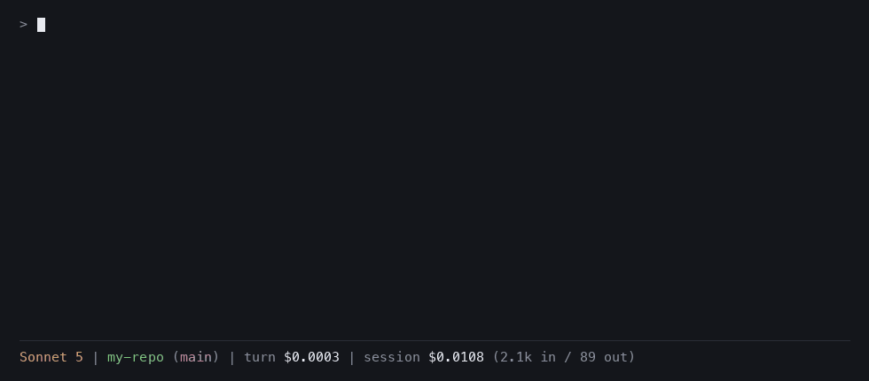
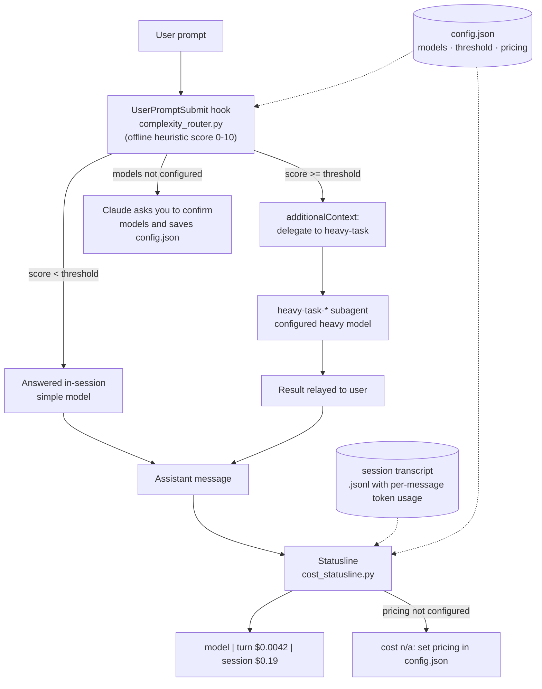
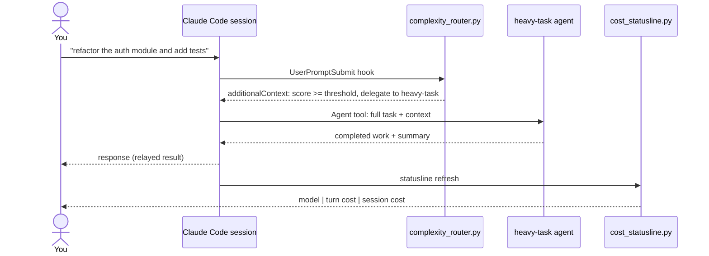

# model-switcher


> Per-prompt model routing and deterministic offline cost tracking for local Claude Code sessions.
>
> Keep simple prompts cheap. Delegate complex work to a heavier model. Track turn and session cost offline.

`model-switcher` is an experimental Claude Code setup that scores every prompt locally before Claude sees it.

Simple prompts stay on your cheaper session model, such as Sonnet. Complex prompts are delegated to a `heavy-task-*` subagent running your configured heavier model, such as Fable 5.

After every response, the statusline shows the token cost of the current turn and the whole session, computed offline from the local Claude Code session transcript using your own pricing table.

No network calls. No external classifier. No model involvement in the routing score.

Works with local Claude Code sessions: CLI, VS Code extension, and desktop local tabs. Does not apply to `claude.ai` cloud sessions.

---

## Why this exists

Not every Claude Code prompt needs the most expensive model.

Some prompts are simple:

- "What does this function do?"
- "Explain this error"
- "Rename this variable"
- "Summarise this file"

Some prompts need a stronger model:

- "Refactor this module and add tests"
- "Debug this cross-file issue"
- "Migrate this auth flow"
- "Review this architecture and suggest changes"

`model-switcher` routes those differently inside local Claude Code sessions.

> Use cheaper models for simple work, use stronger models when the task actually needs it, and keep a local view of session cost.

---

## Demo



*Scripted replay of a real captured session (prompts, agent spawn, and costs are from live transcripts).*

Example statusline:

```text
Sonnet 5 | Context: 45% used / 55% left | my-repo (main) | turn $0.0042 | session $0.19 (26.0k in / 1.0k out)
```

Example complex prompt:

```text
User:   refactor the auth module, migrate the schema and add tests
Claude: Delegating this to the heavy-task-fable agent...
        [heavy-task-fable(Refactor auth module and add tests) runs]
```

When delegation happens, the statusline model name does not change — Claude Code has no hard per-prompt model switch. Instead, Claude spawns the configured `heavy-task-*` subagent (its name shows the model, e.g. `heavy-task-fable`) and relays its answer.

---

## What it does

- Scores each prompt locally before Claude sees it
- Keeps simple prompts on your configured session model
- Delegates complex prompts to a `heavy-task-*` subagent
- Names the subagent for the configured heavy model, for example `heavy-task-fable`, so the model is visible in the task line
- Tracks turn and session cost from the local transcript, including subagent sidechain usage
- Uses your own pricing table — no network calls
- Preserves an existing custom statusline if you already have one
- Adds a marker-delimited routing policy block to `~/.claude/CLAUDE.md`

## What it does not do

- It does not directly switch the main Claude Code session model per prompt
- It does not call an external classifier model
- It does not send your prompt anywhere outside Claude Code
- It does not calculate your official Anthropic bill
- It does not work in `claude.ai` cloud sessions
- It does not provide a hard platform-level guarantee that Claude must delegate every complex prompt

> [!IMPORTANT]
> Claude Code hooks cannot directly switch the main session model per prompt.
> `model-switcher` works by keeping the main session on a cheaper model and delegating complex tasks to a heavier subagent.

---

## Who this is for

Developers who:

- Use Claude Code heavily
- Want better control over model cost
- Want simple prompts to stay cheap and complex prompts to use a stronger model
- Like experimenting with Claude Code hooks, subagents, and statusline commands

---

## Quick start

```sh
git clone https://github.com/jig21nesh/model-switcher.git
cd model-switcher
./install.sh
```

Then:

1. Restart your Claude Code sessions (CLI and VS Code) — settings load at startup.
2. Put your token rates into `~/.claude/model-switcher/config.json` (see [Configure pricing](#2-configure-pricing)).
3. Try a simple prompt: `what does this function do?`
4. Try a complex prompt: `refactor the auth module, migrate the schema and add tests` — Claude should announce it is delegating to `heavy-task-*`.
5. Check the statusline cost output.

Requires `python3` (3.10+) on `PATH`.

---

## Example routing behaviour

| Prompt | Expected route |
|---|---|
| `what does this function do?` | Simple session model |
| `explain this TypeScript error` | Simple session model |
| `rename this variable across the file` | Simple session model |
| `summarise this file` | Simple session model |
| `refactor the auth module and add tests` | Heavy-task subagent |
| `debug this issue across these 5 files` | Heavy-task subagent |
| `migrate this API from v1 to v2` | Heavy-task subagent |
| `review this architecture and suggest implementation changes` | Heavy-task subagent |

Routing is heuristic-based. You can tune the threshold in the config.

---

## When does it delegate?

A prompt is routed to the heavy model when its complexity score reaches `complexity.threshold` (default 5). Real scored examples:

| Score | Verdict | Prompt |
|---|---|---|
| 8/10 | COMPLEX | `build a REST API with auth and database schema` |
| 6/10 | COMPLEX | `review this codebase and tell me what is missing` |
| 6/10 | COMPLEX | `fix the race condition in the payment processor` |
| 5/10 | COMPLEX | `analyse the code and tell me what is missing` |
| 5/10 | COMPLEX | `why does the app deadlock under load?` |
| 2/10 | simple | `explain what a database migration is` |
| 1/10 | simple | `fix the typo in the header` |
| 0/10 | simple | `what does this function do?` |
| 0/10 | simple | `yes go ahead` |

Scoring signals include:

- Strong task verbs such as `refactor`, `implement`, `migrate`, `build`, `review`, `analyse`, `debug`, `investigate`, `audit`, `harden`, and `profile` — inflections like `refactoring` and `migrating` count
- Incident vocabulary such as `race condition`, `deadlock`, `memory leak`, `crash`, and `vulnerability`
- Domain terms such as `test`, `database`, `api`, `schema`, `security`, `fix`, and `bug`
- Numbered multi-step lists, 150+ word prompts, code blocks, multiple file paths, and pasted stack traces

Capped back to simple: short pure questions with no task verb, definitional questions, short affirmations, and negated verbs (`don't refactor`).

Ignored by scoring: slash commands, local command output, agent-relay messages, and subagent contexts. The router reads at most the first 10 KB of a prompt, so huge pastes cannot stall submission.

Dry-run any prompt without spending tokens:

```sh
echo '{"prompt":"review this codebase and tell me what is missing","session_id":"test"}' \
  | python3 ~/.claude/model-switcher/complexity_router.py
```

---

## How it works

`model-switcher` is made of three cooperating pieces:

| Piece | Mechanism | Why |
|---|---|---|
| Complexity routing | `UserPromptSubmit` hook | Runs on every prompt before Claude sees it |
| Heavy execution | `heavy-task-*` subagent | Runs complex work on a configured heavier model |
| Cost display | Statusline command | Shows deterministic local cost output |

Hooks cannot switch the main session model directly — that is a Claude Code platform constraint. So routing works through delegation:

1. You submit a prompt.
2. The `UserPromptSubmit` hook scores the prompt locally.
3. Below the threshold: the prompt stays in the main session.
4. At or above the threshold: Claude receives a mandatory routing directive to delegate the task to `heavy-task-*`.
5. The standing routing-policy block in `~/.claude/CLAUDE.md` reinforces the delegation rule at system-prompt level.
6. The `heavy-task-*` subagent performs the complex work on the configured heavy model.
7. Claude relays the result back to you.
8. The statusline reads the local transcript and shows turn/session cost.

### How routing is enforced, and its limits

Routing is enforced in two layers: the per-prompt directive injected by the hook, and the standing routing-policy block in `~/.claude/CLAUDE.md`. This makes delegation highly reliable in practice, but it is still ultimately the model following instructions — a hard per-prompt guarantee is not possible on this platform. The statusline is your audit trail: a complex turn billed only at the cheap model's rates means a delegation was skipped.

Full decision records: [ADR-0001 (hooks + subagent routing)](docs/adr/0001-hook-plus-subagent-routing.md) and [ADR-0002 (delegation compliance)](docs/adr/0002-claude-md-policy-block-for-delegation-compliance.md).

---

## Architecture



Lifecycle of one complex prompt:



---

## What gets installed where

| Path | Purpose |
|---|---|
| `~/.claude/model-switcher/complexity_router.py` | `UserPromptSubmit` hook |
| `~/.claude/model-switcher/cost_statusline.py` | Statusline command |
| `~/.claude/model-switcher/config.json` | Your configuration — created from `config/config.example.json` if absent, never overwritten |
| `~/.claude/model-switcher/installed.json` | Manifest of your pre-install `model`/`statusLine`/agent, used by uninstall |
| `~/.claude/agents/heavy-task-<model>.md` | The subagent, named for and stamped with your configured complex model, e.g. `heavy-task-fable` |
| `~/.claude/settings.json` | Hook and statusline entries merged in; session model set to your simple model unless `--skip-model` is used |
| `~/.claude/CLAUDE.md` | Marker-delimited routing-policy block (`<!-- model-switcher:begin/end -->`) |

**Your existing setup is never clobbered.** Every touchpoint is merge-based and reversible:

- `settings.json` entries are merged, not overwritten; your previous `model` and `statusLine` are recorded in the manifest and restored on uninstall; one-time backup at `settings.json.model-switcher.bak`.
- `CLAUDE.md`: if you don't have one, the installer creates it with only the policy block (and uninstall deletes it again). If you do, the block is appended after your content with a one-time backup at `CLAUDE.md.model-switcher.bak`; re-installs update only the text between the markers; uninstall removes only the block.
- A custom statusline is preserved: the installer records it as `statusline.wrap_command` and the cost statusline runs it first, appending the cost segment.
- Your config and pricing survive re-installs and uninstalls.

Installer options:

```sh
./install.sh                # full install (also sets session model to models.simple)
./install.sh --skip-model   # install hook/statusline/agent but leave your session model alone
./install.sh --uninstall    # remove everything it added; restores your previous statusline and model
./install.sh --help         # full option reference and what gets installed where
```

---

## Configuration

All configuration lives in `~/.claude/model-switcher/config.json`.

### 1. Choose your models

```json
{
  "models": {
    "complex": "fable",
    "simple": "sonnet"
  }
}
```

- Aliases (`opus`, `sonnet`, `haiku`, `fable`) or full model IDs (`claude-opus-4-8`) are accepted.
- `complex` is the model the `heavy-task-*` agent runs on. **After changing it, re-run `./install.sh`** so the agent file is regenerated (and renamed for the new model).
- `simple` is the session model the installer writes into `settings.json`.
- If either is missing or `null`, Claude asks you to confirm models at the start of your next prompt and saves your answer here.

### 2. Configure pricing

Fill in `pricing_usd_per_mtok` — **$ per million tokens**, four rates per model. Look up the current values at <https://claude.com/pricing> (model IDs and rates: <https://platform.claude.com/docs/en/about-claude/pricing>):

```json
{
  "pricing_usd_per_mtok": {
    "claude-fable-5":   { "input": 10.00, "output": 50.00, "cache_write": 12.50, "cache_read": 1.00 },
    "claude-opus-4-8":  { "input": 5.00, "output": 25.00, "cache_write": 6.25, "cache_read": 0.50 },
    "claude-sonnet-5":  { "input": 3.00, "output": 15.00, "cache_write": 3.75, "cache_read": 0.30 }
  }
}
```

> [!WARNING]
> The numbers above are illustrative only — copy the current rates from the official pricing pages.

A model entry is used only when all four rates are numbers. Dated IDs like `claude-sonnet-5-20250929` match their base entry by prefix. Until at least one entry is complete, the statusline shows a pricing warning and Claude reminds you once per session.

### 3. Tune the threshold

```json
{
  "complexity": {
    "threshold": 5
  }
}
```

Prompts scoring at or above the threshold (0–10, integer or float, clamped to 1–10) are delegated. Raise it if too much gets delegated, lower it for more heavy-model routing. Pricing and threshold changes apply immediately — only `models.complex` needs a re-install.

---

## What you will see

Statusline with pricing configured (appended to your existing statusline if you had one):

```text
Sonnet 5 | Context: 45% used / 55% left | my-repo (main) | turn $0.0042 | session $0.19 (26.0k in / 1.0k out)
```

Statusline before pricing is configured:

```text
Sonnet 5 | cost n/a: set pricing in ~/.claude/model-switcher/config.json (rates: https://claude.com/pricing)
```

A model with tokens in the transcript but no pricing entry is flagged with `no rate: <model-id>` rather than silently dropped. If the transcript carries no usage data at all, the line falls back to Claude Code's built-in estimate, labelled `(builtin est.)`.

---

## Verify the install

Run the pieces exactly as Claude Code will:

```sh
# Complex prompt — expect a delegation directive as JSON
echo '{"prompt":"refactor the auth module, migrate the schema and add tests","session_id":"check"}' \
  | python3 ~/.claude/model-switcher/complexity_router.py

# Simple prompt — expect no output
echo '{"prompt":"what does this function do?","session_id":"check"}' \
  | python3 ~/.claude/model-switcher/complexity_router.py

# Statusline — expect one line ending in a cost segment or the pricing warning
echo '{"model":{"display_name":"Sonnet 5"}}' | python3 ~/.claude/model-switcher/cost_statusline.py
```

In a live session: check the statusline at the bottom, give it a complex prompt — Claude should say it is delegating to `heavy-task-<model>` (e.g. `heavy-task-fable`) — and `/agents` should list the agent with your configured model.

---

## Troubleshooting

### Nothing changed after install

Restart the session — hooks, agents, and settings are loaded at startup. In VS Code the workspace must be trusted for hooks and statusline commands to run.

### Statusline shows `cost n/a`

Pricing isn't configured yet — see [Configure pricing](#2-configure-pricing).

### Complex prompts are not delegated

Run the hook manually (see [Verify the install](#verify-the-install)) and check the score reaches the threshold; lower `complexity.threshold` if needed. Delegation is advisory: Claude follows the injected directive and the CLAUDE.md policy, but the platform has no hard per-prompt model switch.

### I changed `models.complex` but the agent still uses the old model

Re-run `./install.sh` — this regenerates the `heavy-task-*` agent and updates its name to the new model.

### I want my old setup back

`./install.sh --uninstall` restores your previous statusline and session model from the manifest and removes the CLAUDE.md block. Your `config.json` is kept.

---

## How cost is calculated

`statusline/cost_statusline.py` stream-parses the session transcript (`.jsonl`), dedupes streamed assistant messages by message ID, and sums input, output, cache-creation, and cache-read tokens per model — including subagent (sidechain) usage. Cost = tokens × your configured $/MTok rates, computed entirely offline. It is an estimate derived from transcript usage, not your official Anthropic bill.

---

## Is this a subagent or a skill?

It uses a subagent, but the project is not only a subagent. `model-switcher` combines:

1. A `UserPromptSubmit` hook for deterministic prompt scoring — the only thing that runs on every prompt
2. A `heavy-task-*` subagent — the only supported way to run part of a session on a different model
3. A statusline command — the only always-visible, deterministic output surface
4. A `CLAUDE.md` policy block that makes the delegation directives binding

A skill or subagent alone cannot do the whole job because they only run when invoked.

---

## Development

```sh
python3 -m venv .venv
.venv/bin/pip install pytest pytest-cov
.venv/bin/python -m pytest tests/ --cov=hooks --cov=statusline --cov=scripts --cov-branch
```

Runtime code is stdlib-only; `pytest`/`pytest-cov` are development-only dependencies. The router fails open (a hook error never blocks your prompt), the statusline always prints a line, and prompt text is treated as untrusted input everywhere. See [CLAUDE.md](CLAUDE.md) for project conventions and `docs/adr/` for decision records.

---

## Contributing

Contributions are welcome, especially around:

- Better prompt scoring heuristics
- More test cases for edge-case prompts
- Cost reporting improvements
- Documentation and demo examples
- Safer install/uninstall behaviour

`main` is protected: all changes arrive as pull requests and are reviewed and merged by the maintainer. Open an issue first if you want to discuss a larger change.

## Roadmap

- [ ] Add CSV export for cost summaries
- [ ] Add per-project config override
- [ ] Add a dry-run mode that only shows routing decisions
- [ ] Publish first tagged release

## Ideas to fork or extend

- Smarter complexity scoring
- Repo-specific or per-language routing rules
- Daily or weekly cost reports
- Ports to other agentic tools that expose similar hook mechanisms (opencode, Codex CLI, and Gemini CLI are the closest candidates)

---

## FAQ

### Does this really switch Claude Code models per prompt?

Not directly — Claude Code does not expose a hard per-prompt model switch from hooks. This project routes complex work by injecting a mandatory delegation directive, reinforcing it through a `CLAUDE.md` policy block, and using a `heavy-task-*` subagent configured with the heavier model.

### Does this send my prompt to another service?

No. The complexity score is calculated locally using an offline heuristic — no network calls, no external classifier.

### Does the cost tracker show my real bill?

No. It estimates cost from local transcript token usage and your configured pricing table. Treat it as a local estimate, not an official bill.

### Does it work with claude.ai?

No. It only works with local Claude Code sessions where local hooks, agents, settings, and statusline commands are loaded.

### Why not use only a subagent?

Because a subagent does not automatically run before every prompt. The hook is needed for deterministic pre-prompt scoring.

### Why not use only a hook?

Because the hook cannot directly switch the main session model. The subagent is the supported way to run the complex part of the work on a different configured model.

### Why add a policy block to CLAUDE.md?

The hook injects a per-prompt directive, but per-turn context is weighted less than system-prompt content. The `CLAUDE.md` policy block gives Claude a standing, system-prompt-level instruction that makes the routing directives binding in practice.

---

## License

[MIT](LICENSE)
