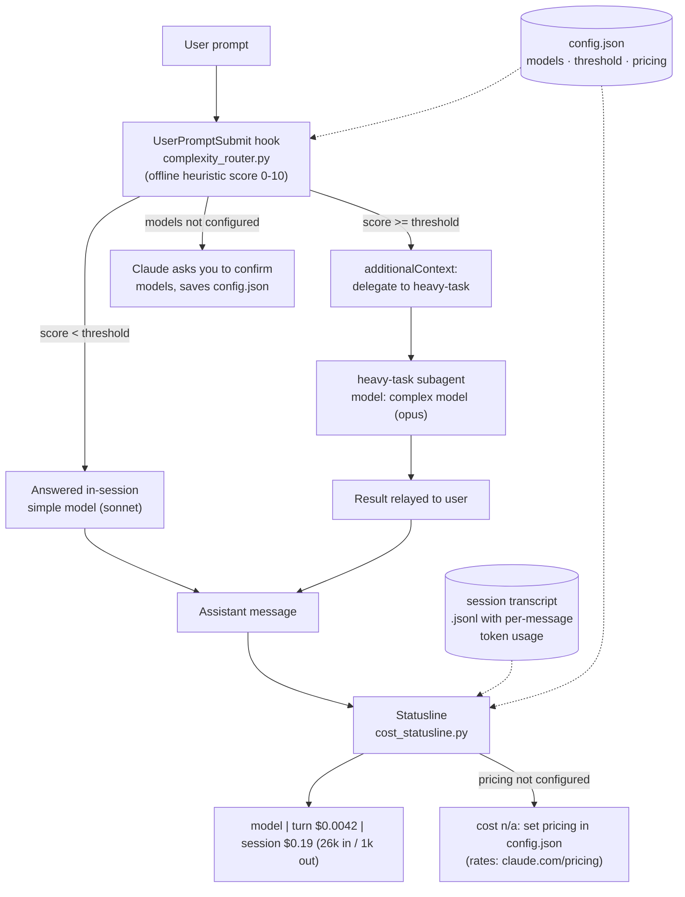
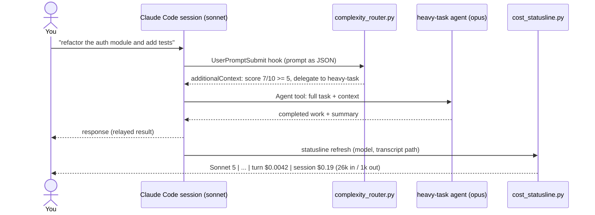

# model-switcher

Per-prompt model routing and deterministic offline cost tracking for all local Claude Code sessions (CLI, VS Code extension, desktop local tabs).

Every prompt is scored for complexity by an offline heuristic before Claude sees it. Complex prompts are delegated to a subagent running your configured heavy model (default: Opus); simple prompts stay on the cheap session model (default: Sonnet). After every response, the statusline shows the token cost of the current turn and the whole session, computed offline from the session transcript using your own pricing table — no network calls, no model involvement.

## Quick start

```sh
git clone https://github.com/jig21nesh/model-switcher.git
cd model-switcher
./install.sh
```

Then:

1. Restart your Claude Code sessions (CLI and VS Code) — settings load at startup.
2. Put your token rates into `~/.claude/model-switcher/config.json` (see [Configure pricing](#2-configure-pricing-required-for-cost-display)). Until you do, the statusline shows `cost n/a` and Claude asks you once per session to fill it in.
3. Type a complex prompt ("refactor X and add tests") — Claude will announce it is delegating to the `heavy-task` agent.

Requires `python3` on `PATH`. Does not apply to claude.ai / cloud sessions — those run on Anthropic-managed VMs where local `~/.claude` configuration never loads.

## Is this a sub-agent or a skill?

Both mechanisms alone can't do this job: skills and sub-agents only run when invoked, and nothing model-driven runs deterministically on *every* request. So model-switcher is three cooperating pieces, each using the only Claude Code mechanism that can do its part:

| Piece | Mechanism | Why |
| --- | --- | --- |
| Complexity routing | `UserPromptSubmit` **hook** | The only thing that executes on every prompt, before Claude sees it |
| Heavy execution | `heavy-task-<model>` **sub-agent** (`~/.claude/agents/heavy-task-opus.md`) | The only supported way to run part of a session on a different model |
| Cost display | **statusline** command | The only always-visible, deterministic output surface; `Stop`-hook output is never shown in chat |

Hooks cannot switch the main session's model — that is a platform constraint, and it's why routing works by delegation. Full decision record: [docs/adr/0001-hook-plus-subagent-routing.md](docs/adr/0001-hook-plus-subagent-routing.md).

## Architecture



Lifecycle of one complex prompt:



## What gets installed where

| Path | Purpose |
| --- | --- |
| `~/.claude/model-switcher/complexity_router.py` | UserPromptSubmit hook |
| `~/.claude/model-switcher/cost_statusline.py` | statusline command |
| `~/.claude/model-switcher/config.json` | your configuration (created from `config/config.example.json` if absent, never overwritten) |
| `~/.claude/model-switcher/installed.json` | manifest of your pre-install `model`/`statusLine`, used by uninstall |
| `~/.claude/agents/heavy-task-<model>.md` | the sub-agent, named for and stamped with your configured complex model (e.g. `heavy-task-opus`), so the model is visible in the task line when it runs |
| `~/.claude/settings.json` | hook + statusline entries merged in; session `model` set to your simple model (one-time backup at `settings.json.model-switcher.bak`) |
| `~/.claude/CLAUDE.md` | a marker-delimited routing-policy block (`<!-- model-switcher:begin/end -->`) that makes delegation directives binding |

**Your existing setup is never clobbered.** Every touchpoint is merge-based and reversible:

- `settings.json`: entries are merged, never overwritten; your previous `model` and `statusLine` are recorded in a manifest and restored on uninstall; one-time backup kept.
- `CLAUDE.md`: if you don't have one, the installer creates it with just the policy block (and uninstall deletes it again). If you do, the block is appended after your content — a one-time backup is kept at `CLAUDE.md.model-switcher.bak`, re-installs update only the text between the markers, and uninstall removes only the block, leaving every byte of yours intact.
- Custom statusline: preserved — the installer records it as `statusline.wrap_command` and the cost statusline runs it first, appending the cost segment to its output.
- Your config and pricing (`config.json`) survive re-installs and uninstalls.

Installer options:

```sh
./install.sh                # full install (also sets session model to models.simple)
./install.sh --skip-model   # install hook/statusline/agent but leave your session model alone
./install.sh --uninstall    # remove everything it added; restores your previous statusline and model
./install.sh --help         # full option reference and what gets installed where
```

## Configuration

All configuration lives in `~/.claude/model-switcher/config.json`.

### 1. Choose your models

```json
"models": {
  "complex": "opus",
  "simple": "sonnet"
}
```

- Aliases (`opus`, `sonnet`, `haiku`, `fable`) or full model IDs (`claude-opus-4-8`) are accepted.
- `complex` is the model the `heavy-task` agent runs on. **After changing it, re-run `./install.sh`** so the agent file is regenerated.
- `simple` is the session model the installer writes into `settings.json`.
- If either is missing or `null`, Claude asks you to confirm models at the start of your next prompt and saves your answer here — you don't have to edit this by hand.

### 2. Configure pricing (required for cost display)

Fill in `pricing_usd_per_mtok` — **$ per million tokens**, four rates per model. Look up the current values at <https://claude.com/pricing> (model IDs: <https://platform.claude.com/docs/en/about-claude/models/overview>):

```json
"pricing_usd_per_mtok": {
  "claude-opus-4-8":  { "input": 5.00, "output": 25.00, "cache_write": 6.25, "cache_read": 0.50 },
  "claude-sonnet-5":  { "input": 3.00, "output": 15.00, "cache_write": 3.75, "cache_read": 0.30 }
}
```

> The numbers above are **illustrative only** — copy the real rates from the pricing page. A model entry is used only when all four rates are numbers; dated IDs like `claude-sonnet-5-20250929` match their base entry by prefix. Until at least one entry is complete, the statusline shows the warning below and Claude reminds you once per session.

### 3. Tune the threshold (optional)

```json
"complexity": { "threshold": 5 }
```

Prompts scoring at or above this (0–10, integer or float, clamped to 1–10) are delegated. Raise it if too much gets delegated, lower it for more Opus. Scoring signals: strong task verbs including inflections (refactor/refactoring, migrate/migrating, ...) and incident vocabulary (race condition, deadlock, memory leak, vulnerability, ...) weigh most, plus moderate domain terms, prompt length, numbered multi-step lists, code blocks, multiple file paths, and pasted stack traces. Negated verbs ("don't refactor") don't count; definitional questions ("what is an end-to-end test?") and short affirmations ("yes go ahead") are capped as simple. Slash commands, local-command output, and subagent contexts are never scored. Scoring reads at most the first 10 KB of a prompt, so huge pastes can't stall submission. Pricing and threshold changes apply immediately — only `models.complex` needs a re-install.

## When does it delegate?

A prompt is routed to the heavy model when its complexity score reaches `complexity.threshold` (default 5). Real scored examples:

| Score | Verdict | Prompt |
|---|---|---|
| 8/10 | COMPLEX | build a REST API with auth and database schema |
| 6/10 | COMPLEX | review this codebase and tell me what is missing |
| 6/10 | COMPLEX | fix the race condition in the payment processor |
| 5/10 | COMPLEX | analyse the code and tell me what is missing |
| 5/10 | COMPLEX | why does the app deadlock under load? |
| 2/10 | simple | explain what a database migration is |
| 1/10 | simple | fix the typo in the header |
| 0/10 | simple | what does this function do? |
| 0/10 | simple | yes go ahead |

Strong task verbs carry the most weight (refactor, implement, migrate, build/create a, review, analyse, debug, investigate, audit, harden, profile — inflections like "migrating" count), along with incident vocabulary (race condition, deadlock, memory leak, crash, vulnerability). Domain terms (test, database, api, schema, security, fix, bug, ...) add a point each; numbered step lists, 150+ word prompts, code blocks, multiple file paths, and pasted stack traces push the score up. Capped back to simple: short pure questions with no task verb, definitional questions, short affirmations, negated verbs. Dry-run any prompt without spending tokens:

```sh
echo '{"prompt":"review this codebase and tell me what is missing","session_id":"test"}' \
  | python3 ~/.claude/model-switcher/complexity_router.py
```

**What delegation looks like:** the statusline model name never changes — Claude Code has no per-prompt model switch. When a prompt is COMPLEX, Claude spawns the `heavy-task` subagent (your heavy model) and relays its answer; you'll see the delegation announced and an agent task running — labelled with the model, e.g. `heavy-task-opus(Analyze codebase for gaps)` — and the session cost rise at the heavy model's rates.

### How routing is enforced — and its limits

Hooks cannot change a request's model, so routing rides on instructions to the model, enforced in two layers: the per-prompt directive injected by the hook (worded as mandatory policy), and a standing routing-policy block the installer adds to `~/.claude/CLAUDE.md` (system-prompt-level context, which models weight much more heavily than per-turn injections). This makes compliance near-universal, but it is still ultimately the model following instructions — a hard per-prompt guarantee is not possible on this platform. The statusline is your audit trail: a COMPLEX turn billed only at the cheap model's rates means a delegation was skipped.

## What you'll see

Statusline with pricing configured (appended to your existing statusline if you had one):

```text
Sonnet 5 | Context: 45% used / 55% left | my-repo (main) | turn $0.0042 | session $0.19 (26.0k in / 1.0k out)
```

Statusline before pricing is configured:

```text
Sonnet 5 | cost n/a: set pricing in ~/.claude/model-switcher/config.json (rates: https://claude.com/pricing)
```

A model with tokens in the transcript but no pricing entry is flagged with `no rate: <model-id>` rather than silently dropped. If the transcript carries no usage data at all, the line falls back to Claude Code's built-in estimate, labelled `(builtin est.)`.

## Verify the install

Run the pieces exactly as Claude Code will:

```sh
# Hook: expect a delegation directive as JSON
echo '{"prompt":"refactor the auth module, migrate the schema and add tests","session_id":"check"}' \
  | python3 ~/.claude/model-switcher/complexity_router.py

# Hook: simple prompt, expect no output
echo '{"prompt":"what does this function do?","session_id":"check"}' \
  | python3 ~/.claude/model-switcher/complexity_router.py

# Statusline: expect one line ending in a cost segment or the pricing warning
echo '{"model":{"display_name":"Sonnet 5"}}' | python3 ~/.claude/model-switcher/cost_statusline.py
```

In a live session: check the statusline at the bottom, and give it a complex prompt — Claude should say it is delegating to `heavy-task-<model>` (e.g. `heavy-task-opus`). `/agents` should list it with your configured model.

## Troubleshooting

- **Nothing changed after install** — restart the session; hooks, agents, and settings are loaded at startup. In VS Code the workspace must be trusted for hooks and statusline to run.
- **Statusline shows `cost n/a`** — pricing isn't configured yet; see [Configure pricing](#2-configure-pricing-required-for-cost-display).
- **Complex prompts aren't delegated** — check the score is reaching the threshold (run the hook manually as above); lower `complexity.threshold` if needed. Delegation is advisory: Claude follows the injected directive, the platform has no hard per-prompt model switch.
- **Changed `models.complex` but agent still uses the old model** — re-run `./install.sh` to regenerate the agent (the old `heavy-task-*` file is replaced and the name updates to the new model).
- **Want your old setup back** — `./install.sh --uninstall` restores your previous statusline and session model from the manifest; your `config.json` is kept.

## How cost is calculated

`statusline/cost_statusline.py` stream-parses the session transcript (`.jsonl`), dedupes streamed assistant messages by message ID, and sums `input`, `output`, `cache_creation`, and `cache_read` tokens per model — including subagent (sidechain) usage. Cost = tokens x your configured $/MTok rates, computed entirely offline. It is an estimate of billing derived from transcript usage, not the bill itself.

## Development

```sh
python3 -m venv .venv && .venv/bin/pip install pytest pytest-cov
.venv/bin/python -m pytest tests/ --cov=hooks --cov=statusline --cov=scripts --cov-branch
```

Runtime code is stdlib-only; `pytest`/`pytest-cov` are dev-only dependencies. The router fails open (a hook error never blocks your prompt) and the statusline always prints a line; prompt text is treated as untrusted input everywhere.
