# model-switcher

Per-prompt model routing and deterministic offline cost tracking for all local Claude Code sessions (CLI, VS Code extension, desktop local tabs).

Every prompt is scored for complexity by an offline heuristic before Claude sees it. Complex prompts are delegated to a subagent running your configured heavy model (default: Opus); simple prompts stay on the cheap session model (default: Sonnet). After every response, the statusline shows the token cost of the current turn and the whole session, computed offline from the session transcript using your own pricing table — no network calls, no model involvement.

## Why hooks + a subagent (and not "just switch the model")

Claude Code hooks cannot change the main session's model, and a `Stop` hook's output is never shown in the chat view. So:

- Routing is done by a `UserPromptSubmit` hook that injects a delegation directive for complex prompts; the `heavy-task` subagent declares its own `model` and does the heavy work.
- Cost display is done by a statusline command, which refreshes after every assistant message and works in both the CLI and the VS Code extension.

See [docs/adr/0001-hook-plus-subagent-routing.md](docs/adr/0001-hook-plus-subagent-routing.md) for the full decision record.

## Architecture

```mermaid
flowchart TD
    U[User prompt] --> H["UserPromptSubmit hook\ncomplexity_router.py\n(offline heuristic score 0-10)"]
    C[("config.json\nmodels · threshold · pricing")] -.-> H
    H -->|"score < threshold"| S["Answered in-session\nsimple model (sonnet)"]
    H -->|"score >= threshold"| D["additionalContext:\ndelegate to heavy-task"]
    H -->|"models not configured"| Q["Claude asks you to confirm\nmodels, saves config.json"]
    D --> A["heavy-task subagent\nmodel: complex model (opus)"]
    A --> R[Result relayed to user]
    S --> T[Assistant message]
    R --> T
    T --> SL["Statusline\ncost_statusline.py"]
    TR[("session transcript\n.jsonl with per-message\ntoken usage")] -.-> SL
    C -.-> SL
    SL --> OUT["model | turn $0.0042 | session $0.19 (26k in / 1k out)"]
    SL -->|"pricing not configured"| WARN["cost n/a: set pricing in config.json\n(rates: claude.com/pricing)"]
```



## Install

```sh
./install.sh                # installs hook, statusline, agent; sets session model to the configured simple model
./install.sh --skip-model   # same, but leaves your session model untouched
./install.sh --uninstall    # removes everything it added and restores your previous statusline and model
```

The installer:

- copies the scripts to `~/.claude/model-switcher/`,
- creates `~/.claude/model-switcher/config.json` from `config/config.example.json` if absent,
- writes `~/.claude/agents/heavy-task.md` with the configured complex model,
- merges the hook and statusline into `~/.claude/settings.json` (a one-time backup is kept at `settings.json.model-switcher.bak`, and the exact previous `model`/`statusLine` values are recorded in `~/.claude/model-switcher/installed.json` for uninstall),
- if you already had a custom statusline, it is preserved: the cost statusline runs it first and appends the cost segment to its output.

Restart Claude Code sessions after installing. Requires `python3` on `PATH`. Does not apply to claude.ai / cloud sessions — those run on Anthropic-managed VMs where local `~/.claude` configuration never loads.

## Configuration

Everything lives in `~/.claude/model-switcher/config.json`:

| Key | Meaning | Unconfigured behaviour |
| --- | --- | --- |
| `models.complex` | Model for the `heavy-task` agent (`opus`, `fable`, full model ID) | Claude asks you to confirm models, then writes them to the config (once per session) |
| `models.simple` | Session model the installer sets (`sonnet`, `haiku`, ...) | same as above |
| `complexity.threshold` | Score (0–10) at or above which a prompt is delegated; default 5 | default 5 |
| `pricing_usd_per_mtok` | Per-model rates in $ per million tokens: `input`, `output`, `cache_write`, `cache_read` | statusline shows `cost n/a` with a link to current rates; Claude also asks you once per session to fill it in |
| `statusline.wrap_command` | Statusline command to run and prefix (set automatically by the installer if you had one) | cost segment is prefixed with the model name only |

Current $/MTok rates: <https://claude.com/pricing> (model list and IDs: <https://platform.claude.com/docs/en/about-claude/models/overview>).

After changing `models.complex`, re-run `./install.sh` so the agent definition is regenerated. Pricing and threshold changes apply immediately.

## How complexity is scored

Deterministic and fully offline (`hooks/complexity_router.py`): strong task verbs (refactor, implement, migrate, debug, ...) weigh most, plus moderate domain terms, prompt length, numbered multi-step lists, code blocks, and multiple file paths. Short pure questions are capped as simple. Scores at or above `complexity.threshold` trigger the delegation directive; the hook fails open, so a hook error never blocks your prompt.

## How cost is calculated

`statusline/cost_statusline.py` stream-parses the session transcript (`.jsonl`), dedupes streamed assistant messages by message ID, and sums `input`, `output`, `cache_creation`, and `cache_read` tokens per model — including subagent (sidechain) usage. Cost = tokens x your configured $/MTok rates. Dated model IDs (`claude-sonnet-5-20250929`) match their base pricing entry by prefix. Models with no matching rate are flagged in the statusline instead of being silently dropped. If the transcript carries no usage data at all, it falls back to Claude Code's built-in estimate, labelled `(builtin est.)`.

## Development

```sh
python3 -m venv .venv && .venv/bin/pip install pytest pytest-cov
.venv/bin/python -m pytest tests/ --cov=hooks --cov=statusline --cov=scripts --cov-branch
```

Runtime code is stdlib-only; `pytest`/`pytest-cov` are dev-only dependencies.
