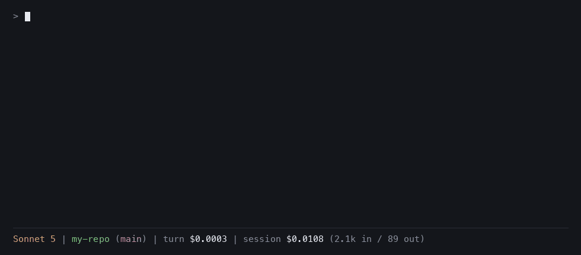
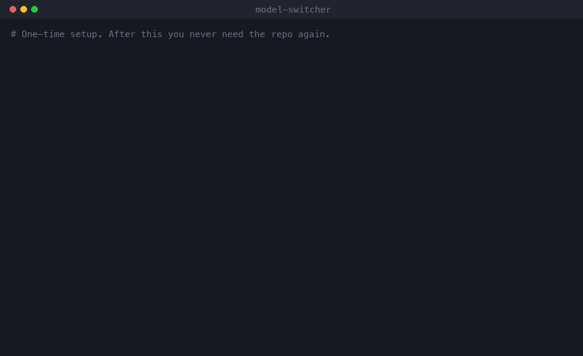
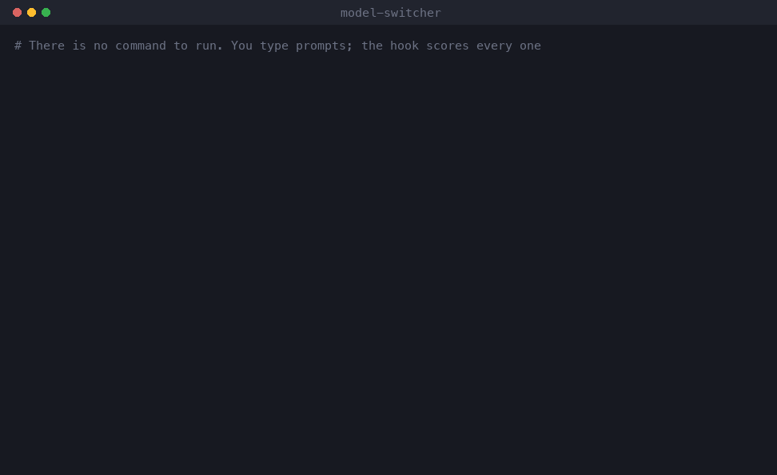
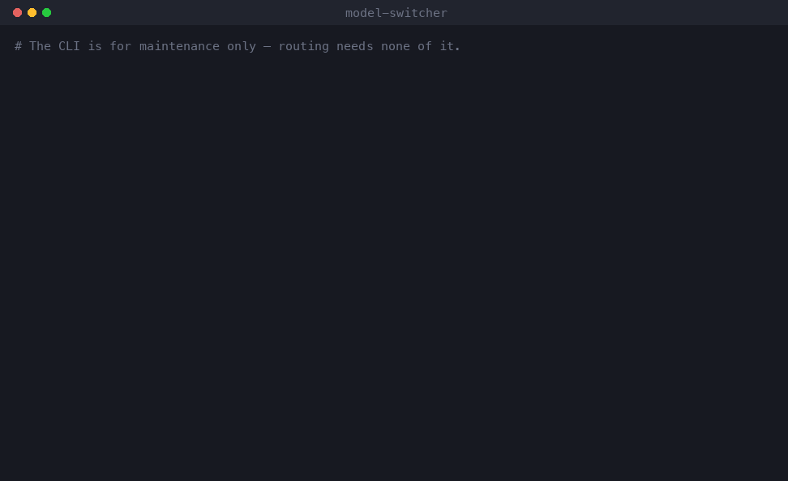
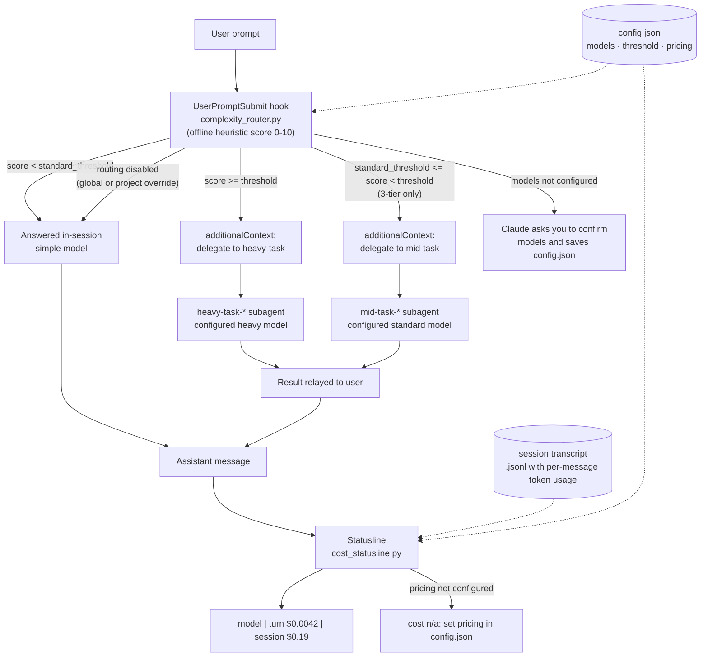
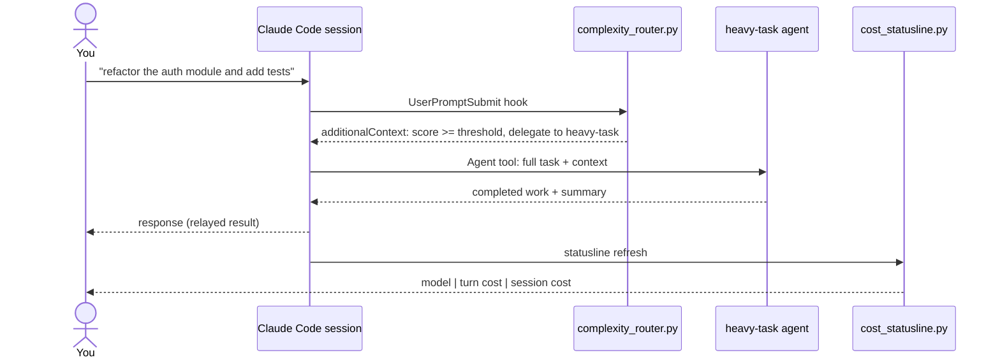

# model-switcher

[](https://github.com/jig21nesh/model-switcher/actions/workflows/ci.yml)


> Per-prompt model routing and deterministic offline cost tracking for local Claude Code sessions.
>
> Keep simple prompts cheap. Delegate complex work to a heavier model. Track turn and session cost offline.

`model-switcher` is an experimental Claude Code setup that scores every prompt locally before Claude sees it.

Simple prompts stay on your cheaper session model, such as Sonnet. Complex prompts are delegated to a `heavy-task-*` subagent running your configured heavier model, such as Fable 5.

After every response, the statusline shows the token cost of the current turn and the whole session, computed offline from the local Claude Code session transcript using your own pricing table.

No network calls. No external classifier. No model involvement in the routing score.

Works with local Claude Code sessions: CLI, VS Code extension, and desktop local tabs. Does not apply to `claude.ai` cloud sessions.

---

## Why this exists

Not every Claude Code prompt needs the most expensive model.

Some prompts are simple:

- "What does this function do?"
- "Explain this error"
- "Rename this variable"
- "Summarise this file"

Some prompts need a stronger model:

- "Refactor this module and add tests"
- "Debug this cross-file issue"
- "Migrate this auth flow"
- "Review this architecture and suggest changes"

`model-switcher` routes those differently inside local Claude Code sessions.

> Use cheaper models for simple work, use stronger models when the task actually needs it, and keep a local view of session cost.

---

## Demo



*Scripted replay of a real captured session (prompts, agent spawn, and costs are from live transcripts).*

Example statusline:

```text
Sonnet 5 | Context: 45% used / 55% left | my-repo (main) | turn $0.0042 | session $0.19 (26.0k in / 1.0k out)
```

Example complex prompt:

```text
User:   refactor the auth module, migrate the schema and add tests
Claude: Delegating this to the heavy-task-fable agent...
        [heavy-task-fable(Refactor auth module and add tests) runs]
```

When delegation happens, the statusline model name does not change — Claude Code has no hard per-prompt model switch. Instead, Claude spawns the configured `heavy-task-*` subagent (its name shows the model, e.g. `heavy-task-fable`) and relays its answer.

### Installing



One command. The hook, statusline, both tier agents, the policy block and the `model-switcher`
command all land in `~/.claude` — **after which the repo is no longer needed**.

### Using it — there is nothing to run



**You never invoke model-switcher to route a prompt.** You type prompts as you always have. The
`UserPromptSubmit` hook scores every one before Claude reads it, and injects a routing directive
only when the score clears a threshold. Simple prompts are answered in the session on your cheap
model; harder ones are delegated to `mid-task-*` or `heavy-task-*`.

### The CLI, for maintenance only



None of these are needed for routing to work — they are for inspecting and tuning it. `explain`
shows where a prompt routes and why, before you spend a token. `tiers` prints your routing ladder.
`learn` tunes the router on your own history and reports the accuracy change. `pricing` refreshes
your rate table.

*All three recordings replay genuine captured output — `tools/capture_demo.sh` runs the real
installer, the real hook and the real CLI in a sandbox, and `tools/make_demo_gif.py` types the
result back. In the session recording, every score and every directive comes from driving the
actual hook; only the `>` prompt framing and the indented labels are added. The `learn` term lists
are withheld because they derive from whatever the operator happened to be working on.*

---

## What it does

- Scores each prompt locally before Claude sees it
- Keeps simple prompts on your configured session model
- Delegates complex prompts to a `heavy-task-*` subagent
- Optionally adds a **third tier** — a `mid-task-*` agent for work that is more than the cheap model but less than the dearest one
- Names each subagent for its configured model, e.g. `heavy-task-fable`, so the model is visible in the task line
- **Learns from your own history** which prompts actually become work, and reports the accuracy change before you apply it
- **Explains any routing decision** without spending a token
- Tracks turn and session cost from the local transcript **and every subagent this session spawned** — priced by cache TTL, so 1-hour cache writes are not billed at the 5-minute rate
- **Shows what routing saved**, measured against the dearest model the session actually used — and shows nothing until a session has genuinely spanned two models
- Uses your own pricing table, refreshable with one command — no network calls from the hook or statusline
- Can be switched off globally or overridden per project, without uninstalling
- Preserves an existing custom statusline if you already have one
- Adds a marker-delimited routing policy block to `~/.claude/CLAUDE.md`
- **Needs the repo only to install or upgrade** — the CLI installs alongside everything else, and can even uninstall itself

## What it does not do

- It does not directly switch the main Claude Code session model per prompt
- It does not call an external classifier model
- It does not send your prompt anywhere outside Claude Code
- It does not calculate your official Anthropic bill
- It does not work in `claude.ai` cloud sessions
- It does not provide a hard platform-level guarantee that Claude must delegate every complex prompt

> [!IMPORTANT]
> Claude Code hooks cannot directly switch the main session model per prompt.
> `model-switcher` works by keeping the main session on a cheaper model and delegating complex tasks to a heavier subagent.

---

## Who this is for

Developers who:

- Use Claude Code heavily
- Want better control over model cost
- Want simple prompts to stay cheap and complex prompts to use a stronger model
- Like experimenting with Claude Code hooks, subagents, and statusline commands

---

## Quick start

```sh
git clone https://github.com/jig21nesh/model-switcher.git
cd model-switcher
./install.sh
```

The installer puts a `model-switcher` command in `~/.claude/model-switcher/` alongside everything
else, so the commands below keep working after you delete the clone. Add that directory to your
`PATH` (or symlink the binary) to type just `model-switcher`; otherwise call it by full path, or
run `./bin/model-switcher` from the repo.

Then:

1. Restart your Claude Code sessions (CLI and VS Code) — settings load at startup.
2. Verify the token rates in `~/.claude/model-switcher/config.json` against the official pricing pages (see [Configure pricing](#2-configure-pricing)).
3. Try a simple prompt: `what does this function do?`
4. Try a complex prompt: `refactor the auth module, migrate the schema and add tests` — Claude should announce it is delegating to `heavy-task-*`.
5. Check the statusline cost output.

Requires `python3` (3.10+) on `PATH`.

---

## Example routing behaviour

| Prompt | Expected route |
|---|---|
| `what does this function do?` | Simple session model |
| `explain this TypeScript error` | Simple session model |
| `rename this variable across the file` | Simple session model |
| `summarise this file` | Simple session model |
| `refactor the auth module and add tests` | Heavy-task subagent |
| `debug this issue across these 5 files` | Heavy-task subagent |
| `migrate this API from v1 to v2` | Heavy-task subagent |
| `review this architecture and suggest implementation changes` | Heavy-task subagent |

Routing is heuristic-based. You can tune the threshold in the config.

---

## When does it delegate?

A prompt is routed to the heavy model when its complexity score reaches `complexity.threshold` (default 5). Real scored examples:

| Score | Verdict | Prompt |
|---|---|---|
| 8/10 | COMPLEX | `build a REST API with auth and database schema` |
| 6/10 | COMPLEX | `review this codebase and tell me what is missing` |
| 6/10 | COMPLEX | `fix the race condition in the payment processor` |
| 5/10 | COMPLEX | `analyse the code and tell me what is missing` |
| 5/10 | COMPLEX | `why does the app deadlock under load?` |
| 2/10 | simple | `explain what a database migration is` |
| 1/10 | simple | `fix the typo in the header` |
| 0/10 | simple | `what does this function do?` |
| 0/10 | simple | `yes go ahead` |

Scoring signals include:

- Strong task verbs such as `refactor`, `implement`, `migrate`, `build`, `review`, `analyse`, `debug`, `investigate`, `audit`, `harden`, and `profile` — inflections like `refactoring` and `migrating` count
- Incident vocabulary such as `race condition`, `deadlock`, `memory leak`, `crash`, and `vulnerability`
- Domain terms such as `test`, `database`, `api`, `schema`, `security`, `fix`, and `bug`
- Numbered multi-step lists, 150+ word prompts, code blocks, multiple file paths, and pasted stack traces

Capped back to simple: short pure questions with no task verb, definitional questions, short affirmations, and negated verbs (`don't refactor`).

Ignored by scoring: slash commands, local command output, agent-relay messages, and subagent contexts. The router reads at most the first 10 KB of a prompt, so huge pastes cannot stall submission — put your request *before* a large paste, because an ask that lands past the 10 KB cutoff is not scored and the prompt may route as simple.

### Teaching it from your own history

The built-in list is a fixed guess. `learn` reads your local transcripts and asks a different
question of every past prompt: *did it actually become work?* Tool calls, file edits and spawned
subagents are all recorded, so the answer is observable rather than assumed.

```sh
model-switcher learn          # analyse and write a candidate — routing unchanged
model-switcher learn --apply  # promote the candidate to live
```

It prints a before/after comparison measured on **your own** history, so you can see whether it
helps before committing:

```text
corpus: 2,124 usable prompts from 101 sessions (533 became real work, 1,591 did not)

routing accuracy at threshold 5, measured on your own history:
                precision   recall     F1   wasted   missed
  built-in          33.0%    34.3%   33.6      372      350
  with terms        41.9%    42.4%   42.1      314      307
```

Nothing changes until you pass `--apply`, and nothing leaves your machine. The output is a JSON
weight table — no prompt text, no hashes, no paths — filtered so a term must recur across at least
three separate sessions and ten occurrences before it can appear, and shaped to exclude hostnames,
identifiers and API keys. Full detail, including the exact tokenization other tools need in order
to consume it: [`docs/classifier-schema.md`](docs/classifier-schema.md).

> [!NOTE]
> The label is a proxy. A hard question answered correctly in two tool calls counts as "light", so
> the weights optimise for *became work*, which correlates with *needed the better model* without
> being identical to it. Review the candidate before applying it.

### Ask why a prompt routes the way it does

`explain` scores a prompt and shows its working, without spending a token:

```sh
model-switcher explain "ensure the deployment pipeline works end2end"
```

```text
  domain terms (pipeline, deployment)            +2
                                              -----
  built-in score                                  2
  learned terms                                +2.0
    ensure +1.16, end2end +0.88

  score 4/10   threshold 5   MODERATE -> mid-task-sonnet

  routing ladder (3 tiers)
     score < 3               simple    haiku         answered in-session
  -> 3 <= score < 5          moderate  sonnet        mid-task-sonnet
     score >= 5              complex   fable         heavy-task-fable
```

Add `--no-classifier` to see the built-in signals alone. The explanation comes from the same code
path that does the routing, so it cannot disagree with what actually happens — and the ladder
underneath shows the other bands, so you can see what a slightly harder prompt would have done.

Learned weights are bounded: they can move a score by at most ±3, and the lookup caps are applied
*after* them, so no weight table — however skewed or hand-edited — can turn a short question into a
delegation. A missing or corrupt classifier is ignored and routing proceeds as if it were not there.

Or run the hook exactly as Claude Code does:

```sh
echo '{"prompt":"review this codebase and tell me what is missing","session_id":"test"}' \
  | python3 ~/.claude/model-switcher/complexity_router.py
```

---

## How it works

`model-switcher` is made of three cooperating pieces:

| Piece | Mechanism | Why |
|---|---|---|
| Complexity routing | `UserPromptSubmit` hook | Runs on every prompt before Claude sees it |
| Heavy execution | `heavy-task-*` subagent | Runs complex work on a configured heavier model |
| Cost display | Statusline command | Shows deterministic local cost output |

Hooks cannot switch the main session model directly — that is a Claude Code platform constraint. So routing works through delegation:

1. You submit a prompt.
2. The `UserPromptSubmit` hook scores the prompt locally.
3. Below the threshold: the prompt stays in the main session.
4. At or above the threshold: Claude receives a mandatory routing directive to delegate the task to `heavy-task-*`.
5. The standing routing-policy block in `~/.claude/CLAUDE.md` reinforces the delegation rule at system-prompt level.
6. The `heavy-task-*` subagent performs the complex work on the configured heavy model.
7. Claude relays the result back to you.
8. The statusline reads the local transcript and shows turn/session cost.

### How routing is enforced, and its limits

Routing is enforced in two layers: the per-prompt directive injected by the hook, and the standing routing-policy block in `~/.claude/CLAUDE.md`. This makes delegation highly reliable in practice, but it is still ultimately the model following instructions — a hard per-prompt guarantee is not possible on this platform. The statusline is your audit trail: a complex turn billed only at the cheap model's rates means a delegation was skipped.

Full decision records: [ADR-0001 (hooks + subagent routing)](docs/adr/0001-hook-plus-subagent-routing.md) and [ADR-0002 (delegation compliance)](docs/adr/0002-claude-md-policy-block-for-delegation-compliance.md).

---

## Architecture


```mermaid
flowchart TD
    U[User prompt] --> H["UserPromptSubmit hook<br/>complexity_router.py<br/>(offline heuristic score 0-10)"]

    C[("config.json<br/>models · threshold · pricing")] -.-> H

    H -->|"score < standard_threshold"| S["Answered in-session<br/>simple model"]
    H -->|"standard_threshold <= score < threshold<br/>(3-tier only)"| M["additionalContext:<br/>delegate to mid-task"]
    H -->|"score >= threshold"| D["additionalContext:<br/>delegate to heavy-task"]
    H -->|"models not configured"| Q["Claude asks you to confirm<br/>models and saves config.json"]
    H -->|"routing disabled<br/>(global or project override)"| S

    M --> B["mid-task-* subagent<br/>configured standard model"]
    D --> A["heavy-task-* subagent<br/>configured heavy model"]
    A --> R[Result relayed to user]
    B --> R

    S --> T[Assistant message]
    R --> T

    T --> SL["Statusline<br/>cost_statusline.py"]

    TR[("session transcript<br/>.jsonl with per-message token usage")] -.-> SL
    C -.-> SL

    SL --> OUT["model | turn $0.0042 | session $0.19"]
    SL -->|"pricing not configured"| WARN["cost n/a: set pricing in config.json"]
```

Lifecycle of one complex prompt:


```mermaid
sequenceDiagram
    actor U as You
    participant CC as Claude Code session
    participant H as complexity_router.py
    participant A as heavy-task agent
    participant SL as cost_statusline.py

    U->>CC: "refactor the auth module and add tests"
    CC->>H: UserPromptSubmit hook
    H-->>CC: additionalContext: score >= threshold, delegate to heavy-task
    CC->>A: Agent tool: full task + context
    A-->>CC: completed work + summary
    CC-->>U: response (relayed result)
    CC->>SL: statusline refresh
    SL-->>U: model | turn cost | session cost
```

---

## What gets installed where

| Path | Purpose |
|---|---|
| `~/.claude/model-switcher/complexity_router.py` | `UserPromptSubmit` hook |
| `~/.claude/model-switcher/cost_statusline.py` | Statusline command |
| `~/.claude/model-switcher/config.json` | Your configuration — created from `config/config.example.json` if absent, never overwritten |
| `~/.claude/model-switcher/installed.json` | Manifest of your pre-install `model`/`statusLine`/agent, used by uninstall |
| `~/.claude/model-switcher/model-switcher` | The `pricing` / `learn` / `explain` CLI, plus the modules and rate table it needs — so it keeps working if you delete the clone |
| `~/.claude/model-switcher/classifier.json` | Learned routing weights, once you run `learn --apply`. Kept on uninstall, like your config |
| `~/.claude/agents/heavy-task-<model>.md` | The subagent, named for and stamped with your configured complex model, e.g. `heavy-task-fable` |
| `~/.claude/agents/mid-task-<model>.md` | The middle-tier subagent — only when `models.standard` is set, e.g. `mid-task-sonnet` |
| `~/.claude/settings.json` | Hook and statusline entries merged in; session model set to your simple model unless `--skip-model` is used |
| `~/.claude/CLAUDE.md` | Marker-delimited routing-policy block (`<!-- model-switcher:begin/end -->`) |

**Your existing setup is never clobbered.** Every touchpoint is merge-based and reversible:

- `settings.json` entries are merged, not overwritten; your previous `model` and `statusLine` are recorded in the manifest and restored on uninstall; one-time backup at `settings.json.model-switcher.bak`.
- `CLAUDE.md`: if you don't have one, the installer creates it with only the policy block (and uninstall deletes it again). If you do, the block is appended after your content with a one-time backup at `CLAUDE.md.model-switcher.bak`; re-installs update only the text between the markers; uninstall removes only the block.
- A custom statusline is preserved: the installer records it as `statusline.wrap_command` and the cost statusline runs it first, appending the cost segment.
- Your config and pricing survive re-installs and uninstalls.

Installer options:

```sh
./install.sh                # full install (also sets session model to models.simple)
./install.sh --skip-model   # install hook/statusline/agent but leave your session model alone
./install.sh --uninstall    # remove everything it added; restores your previous statusline and model
```

You do not need the repo to remove it later — the installed CLI can do it:

```sh
model-switcher uninstall          # show what would be removed, change nothing
model-switcher uninstall --yes    # do it
./install.sh --help         # full option reference and what gets installed where
```

---

## Configuration

All configuration lives in `~/.claude/model-switcher/config.json`.

### 1. Choose your models

```json
{
  "models": {
    "complex": "fable",
    "simple": "sonnet",
    "standard": null
  }
}
```

Three models can be configured, from dearest to cheapest:

| Key | Role | Runs on |
|---|---|---|
| `complex` | the expensive tier — hardest prompts | `heavy-task-*` subagent |
| `standard` | the middle tier, **optional** | `mid-task-*` subagent |
| `simple` | the cheap tier — everything else | your session itself |

- Aliases (`opus`, `sonnet`, `haiku`, `fable`) or full model IDs (`claude-opus-4-8`) are accepted.
- `complex` is the model the `heavy-task-*` agent runs on. **After changing it, re-run `./install.sh`** so the agent file is regenerated (and renamed for the new model).
- `simple` is the session model the installer writes into `settings.json`.
- `standard` is optional and enables the **third tier** — see below. Leave it `null` for the two-tier default.
- If `complex` or `simple` is missing or `null`, Claude asks you to confirm models at the start of your next prompt and saves your answer here.

Whatever you set, `model-switcher tiers` prints the ladder your config actually produces:

```text
  routing ladder (3 tiers)
     score < 3               simple    haiku         answered in-session
     3 <= score < 5          moderate  sonnet        mid-task-sonnet
     score >= 5              complex   fable         heavy-task-fable
```

The installer prints the same ladder when it finishes, and `explain` prints it with `->` against
the band your prompt landed in. All three come from one function, so what you are shown is what
the router will do.

### 1a. Optional: add a middle tier

With two tiers, everything above the threshold pays top-model rates — including work that is more
than the cheap model handles well but nowhere near worth Fable. Setting `models.standard` adds a
middle band:

```json
{
  "models": { "complex": "fable", "standard": "sonnet", "simple": "haiku" },
  "complexity": { "threshold": 5, "standard_threshold": 3 }
}
```

| Score | Routes to |
|---|---|
| `>= threshold` (5) | `heavy-task-fable` |
| `>= standard_threshold` (3), below 5 | `mid-task-sonnet` |
| below 3 | answered in-session on `simple` |

**Re-run `./install.sh` after adding it** — that generates the second agent. Removing
`models.standard` and re-running deletes it again. Check the result with `model-switcher tiers`.

`routing.tiers` controls this explicitly: `"auto"` (the default — three tiers when `models.standard`
is valid, two otherwise), or a literal `2`/`3`. A project can drop to two tiers with
`{"routing": {"tiers": 2}}` in `.claude/model-switcher.json` without touching the global config.
`standard_threshold` is always forced strictly below `threshold`; an overlapping pair is clamped
with a warning rather than silently making the middle band unreachable.

### 2. Configure pricing

`pricing_usd_per_mtok` ships pre-filled for every current model — **$ per million tokens**:

```json
{
  "pricing_usd_per_mtok": {
    "claude-fable-5":  { "input": 10.00, "output": 50.00, "cache_write": 12.50, "cache_write_1h": 20.00, "cache_read": 1.00 },
    "claude-opus-5":   { "input": 5.00, "output": 25.00, "cache_write": 6.25, "cache_write_1h": 10.00, "cache_read": 0.50 },
    "claude-sonnet-5": { "input": 2.00, "output": 10.00, "cache_write": 2.50, "cache_write_1h": 4.00, "cache_read": 0.20 }
  }
}
```

Four rates are required (`input`, `output`, `cache_write`, `cache_read`). Two are optional:

- **`cache_write_1h`** — cache writes are billed by time-to-live: 1.25× input at a 5-minute TTL, **2× input at a 1-hour TTL**. `cache_write` is the 5-minute rate. Claude Code uses 1-hour caching heavily, so leaving this out under-reports cost substantially — on a real 3,200-transcript corpus, by about 60% of cache-write spend.
- **`fast`** — a nested rate block used when a turn reports `usage.speed == "fast"`. Fast mode runs the same model at premium rates.

Both are optional and their absence reproduces the previous behaviour exactly, so an older config keeps working.

### Keeping rates current

```sh
model-switcher pricing              # compare your config against the maintained table
model-switcher pricing --yes        # apply the differences (backs up your config first)
model-switcher pricing --offline    # use the bundled table, no network
```

The check exits non-zero when your rates have drifted, so it works in a scheduled job. It fetches
`config/pricing.json` from this repo over HTTPS, validates every rate before writing anything, and
leaves models it does not recognise — including any you added yourself — untouched. The hook and
the statusline never make network calls; this is the only command that does.

> [!WARNING]
> Model prices change. `claude-sonnet-5` currently shows introductory pricing that reverts to $3.00/$15.00 after 2026-08-31. Re-run the pricing check rather than trusting a table you installed months ago.

A model entry is used only when all four required rates are usable numbers — a `true`, a negative, or a non-numeric rate disqualifies the entry rather than being coerced. Dated IDs like `claude-sonnet-5-20250929` match their base entry by prefix. Until at least one entry is complete, the statusline shows a pricing warning and Claude reminds you once per session.

### 3. Tune the threshold

```json
{
  "complexity": {
    "threshold": 5
  }
}
```

Prompts scoring at or above the threshold (0–10, integer or float, clamped to 1–10) are delegated. Raise it if too much gets delegated, lower it for more heavy-model routing. Pricing and threshold changes apply immediately — only `models.complex` needs a re-install.

### 4. Switch routing on and off

```json
{
  "routing": {
    "enabled": false
  }
}
```

With `routing.enabled` set to `false` the hook stays silent: no scoring, no delegation directives, no setup nags. The statusline and cost tracking are unaffected. Takes effect on your next prompt — no re-install needed. Absent or `true` means routing is on.

Any project can override the switch and the threshold with a `.claude/model-switcher.json` in the project root:

```json
{
  "routing": { "enabled": true },
  "complexity": { "threshold": 7 }
}
```

Only the `routing` and `complexity` sections can be overridden per project — `models` and pricing stay global, because the heavy-task agent is generated from the global config at install time. Typical uses: routing off globally but on for one expensive repo, or a higher threshold in a repo where most work is simple.

Two things to watch:

- Values must be proper JSON types: `enabled` a bare `true`/`false`, `threshold` a number. An invalid value (e.g. `"enabled": "false"` as a quoted string) is ignored with a one-line stderr warning and the **global** setting stays in effect — a typo cannot silently flip routing.
- The override is read from the session's working directory exactly (`<cwd>/.claude/model-switcher.json`). There is no parent-directory search, so a repo-root override does not apply to a session started in a subdirectory of that repo.

---

## What you will see

Statusline with pricing configured (appended to your existing statusline if you had one):

```text
Sonnet 5 | my-repo (main) | turn $0.0042 | session $4.23 | saved $8.13 (66% vs fable-5) | 3.3M in / 33.0k out | 3 tiers
```

### What each segment means

| Segment | Shows | Quiet when |
|---|---|---|
| `turn` | Cost of the current turn | never |
| `session` | Cost of the whole session | never |
| `saved` | What routing avoided versus the dearest model this session actually used | nothing was routed |
| `tokens` | Total tokens in / out | never |
| `routing` | `routing off`, or `3 tiers` when a middle tier is active | plain two-tier routing |
| `models` | Your model ladder, e.g. `haiku > sonnet > fable` | not in the default set |

`saved` is a **counterfactual, not a bill**: it re-prices every token in the transcript at the rates
of the most expensive model the session actually ran on, and subtracts what you really spent. The
model it compares against is named in the output, so the percentage always has a stated denominator.

It stays silent until a session has genuinely spanned two or more priced models. One model means
nothing was ever delegated, so nothing was saved — and a baseline taken from your *configured*
`complex` model rather than from what actually ran will happily report a large saving for a session
where the router never fired. (A session on `claude-opus-5` with `complex: fable` reported a
constant `saved 50%` for exactly this reason: fable is precisely twice opus on every rate, so the
figure came from the rate table, not from routing. See
[ADR-0009](docs/adr/0009-savings-measured-from-observed-models.md).)

This under-reports rather than over-reports: an all-cheap session shows no saving even though the
heavy model would genuinely have cost more. For a number the tool computes about its own value,
that is the right direction to be wrong in.

Choose your own line with `statusline.segments`, in the order you want them:

```json
{
  "statusline": {
    "segments": ["turn", "session", "saved", "tokens", "routing"],
    "savings_baseline": null
  }
}
```

`savings_baseline` pins the comparison to a specific pricing key instead of letting it float to
whatever the session's dearest model turned out to be. It does not bypass the two-model rule — a
session that never left one model still reports no saving. Unknown segment names are ignored with a
warning rather than breaking the line.

Statusline before pricing is configured:

```text
Sonnet 5 | cost n/a: set pricing in ~/.claude/model-switcher/config.json (rates: https://claude.com/pricing)
```

A model with tokens in the transcript but no pricing entry is flagged with `no rate: <model-id>` rather than silently dropped. Entries that billed **nothing** are not flagged — Claude Code writes `<synthetic>` placeholders for interrupts and error messages with every token field at zero, and warning about a missing rate for those would imply cost data you cannot supply. If the transcript carries no usage data at all, the line falls back to Claude Code's built-in estimate, labelled `(builtin est.)`.

---

## Verify the install

Run the pieces exactly as Claude Code will:

```sh
# Complex prompt — expect a delegation directive as JSON
echo '{"prompt":"refactor the auth module, migrate the schema and add tests","session_id":"check"}' \
  | python3 ~/.claude/model-switcher/complexity_router.py

# Simple prompt — expect no output
echo '{"prompt":"what does this function do?","session_id":"check"}' \
  | python3 ~/.claude/model-switcher/complexity_router.py

# Statusline — expect one line ending in a cost segment or the pricing warning
echo '{"model":{"display_name":"Sonnet 5"}}' | python3 ~/.claude/model-switcher/cost_statusline.py
```

In a live session: check the statusline at the bottom, give it a complex prompt — Claude should say it is delegating to `heavy-task-<model>` (e.g. `heavy-task-fable`) — and `/agents` should list the agent with your configured model.

---

## Troubleshooting

### Nothing changed after install

Restart the session — hooks, agents, and settings are loaded at startup. In VS Code the workspace must be trusted for hooks and statusline commands to run.

### Statusline shows `cost n/a`

Pricing isn't configured yet — see [Configure pricing](#2-configure-pricing).

### Complex prompts are not delegated

Run the hook manually (see [Verify the install](#verify-the-install)) and check the score reaches the threshold; lower `complexity.threshold` if needed. Delegation is advisory: Claude follows the injected directive and the CLAUDE.md policy, but the platform has no hard per-prompt model switch.

### I changed `models.complex` but the agent still uses the old model

Re-run `./install.sh` — this regenerates the `heavy-task-*` agent and updates its name to the new model.

### I want my old setup back

`./install.sh --uninstall` from the repo, or `model-switcher uninstall --yes` from the install
itself, restores your previous statusline and session model from the manifest and removes the
CLAUDE.md block. Both run the same code. Your `config.json` and any learned `classifier.json` are
kept — they are your data, not the tool's.

---

## Lifecycle verification

Beyond the unit suite, the full session lifecycle was exercised end-to-end with simulated user sessions driving the real hook and statusline binaries in isolated sandboxes (`MODEL_SWITCHER_HOME`) — about 50 scenarios including hostile input, all passing with exit code 0:

| Lifecycle phase | Coverage |
|---|---|
| Session start | Setup nags fire once (missing config, null pricing); slash-command first prompts preserve the nag; garbage stdin, path-traversal session IDs, and corrupted config all fail open; statusline always prints one line |
| During session | 12-turn conversation mixing simple/complex/affirmation/negation/stack-trace prompts; subagent and command-tag contexts skipped; hostile shell-metacharacter prompts stay inert data; statusline turn/session math hand-verified incl. sidechains, streamed-duplicate dedupe, and unpriced-model flagging |
| Resume / restart | Nag state survives resume and re-fires only for new sessions; stale state cleanup touches only its own files; corrupted state self-heals; config flips apply on the next prompt; resumed transcripts never double-count |
| Routing switch | Global toggle and per-project overrides across every combination; malformed, oversized, injection, and wrong-typed overrides all fall open to the global config |

Full scenario tables and findings: [docs/lifecycle-test-report.md](docs/lifecycle-test-report.md).

---

## How cost is calculated

`statusline/cost_statusline.py` stream-parses the session transcript (`.jsonl`), dedupes streamed assistant messages by message ID, and sums input, output, cache-creation, and cache-read tokens per model. Claude Code writes each spawned agent to its own file under `<project>/<session-id>/`, so those are read too and attributed to the turn by timestamp — without them, agent-heavy sessions under-report badly. Cost = tokens × your configured $/MTok rates, computed entirely offline. It is an estimate derived from transcript usage, not your official Anthropic bill.

Cache writes are split by TTL: the transcript reports `ephemeral_5m_input_tokens` and `ephemeral_1h_input_tokens` separately, and each bucket is priced at its own rate. Where that per-TTL breakdown is present it is treated as authoritative — a few entries carry a flat `cache_creation_input_tokens` total that disagrees with the breakdown beside it, and mixing the two would double-count. Entries reporting `usage.speed == "fast"` are priced from the model's `fast` rate block when one is configured.

---

## Is this a subagent or a skill?

It uses a subagent, but the project is not only a subagent. `model-switcher` combines:

1. A `UserPromptSubmit` hook for deterministic prompt scoring — the only thing that runs on every prompt
2. A `heavy-task-*` subagent — the only supported way to run part of a session on a different model
3. A statusline command — the only always-visible, deterministic output surface
4. A `CLAUDE.md` policy block that makes the delegation directives binding

A skill or subagent alone cannot do the whole job because they only run when invoked.

---

## Development

```sh
python3 -m venv .venv
.venv/bin/pip install pytest pytest-cov
.venv/bin/python -m pytest tests/ -q                 # full suite
.venv/bin/python -m pytest tests/ -q -m lifecycle    # real install.sh against a temp CLAUDE_DIR
```

Runtime code is stdlib-only; `pytest`/`pytest-cov` are development-only dependencies. CI runs the
suite on Python 3.10–3.14, lints with `ruff` and `shellcheck`, enforces an 80% line-and-branch
coverage floor **per file**, and exercises a full install/uninstall cycle on Linux and macOS.

The router fails open (a hook error never blocks your prompt), the statusline always prints a line, and prompt text is treated as untrusted input everywhere. See [CONTRIBUTING.md](CONTRIBUTING.md) for the full check list, [CLAUDE.md](CLAUDE.md) for project conventions, and `docs/adr/` for decision records.

---

## Contributing

Contributions are welcome, especially around:

- Better prompt scoring heuristics
- More test cases for edge-case prompts
- Cost reporting improvements
- Documentation and demo examples
- Safer install/uninstall behaviour

`main` is protected: all changes arrive as pull requests and are reviewed and merged by the maintainer. Open an issue first if you want to discuss a larger change. Start with [CONTRIBUTING.md](CONTRIBUTING.md) — it lists the checks CI runs and the hard rules for code on the per-prompt path. Security issues go through [SECURITY.md](SECURITY.md), privately, rather than a public issue.

## Roadmap

- [ ] Add CSV export for cost summaries
- [x] Add per-project config override — shipped in [v0.2.0](https://github.com/jig21nesh/model-switcher/releases/tag/v0.2.0)
- [x] Add a dry-run mode that only shows routing decisions — `model-switcher explain`
- [x] Learn routing weights from your own history — `model-switcher learn`
- [x] Publish first tagged release — [v0.1.0](https://github.com/jig21nesh/model-switcher/releases/tag/v0.1.0)

## Ideas to fork or extend

- Smarter complexity scoring
- Repo-specific or per-language routing rules
- Daily or weekly cost reports
- Ports to other agentic tools that expose similar hook mechanisms (opencode, Codex CLI, and Gemini CLI are the closest candidates)

---

## FAQ

### Does this really switch Claude Code models per prompt?

Not directly — Claude Code does not expose a hard per-prompt model switch from hooks. This project routes complex work by injecting a mandatory delegation directive, reinforcing it through a `CLAUDE.md` policy block, and using a `heavy-task-*` subagent configured with the heavier model.

### Does this send my prompt to another service?

No. The complexity score is calculated locally using an offline heuristic — no network calls, no external classifier.

### Does the cost tracker show my real bill?

No. It estimates cost from local transcript token usage and your configured pricing table. Treat it as a local estimate, not an official bill.

### Does it work with claude.ai?

No. It only works with local Claude Code sessions where local hooks, agents, settings, and statusline commands are loaded.

### Why not use only a subagent?

Because a subagent does not automatically run before every prompt. The hook is needed for deterministic pre-prompt scoring.

### Why not use only a hook?

Because the hook cannot directly switch the main session model. The subagent is the supported way to run the complex part of the work on a different configured model.

### Why add a policy block to CLAUDE.md?

The hook injects a per-prompt directive, but per-turn context is weighted less than system-prompt content. The `CLAUDE.md` policy block gives Claude a standing, system-prompt-level instruction that makes the routing directives binding in practice.

---

## License

[MIT](LICENSE)
